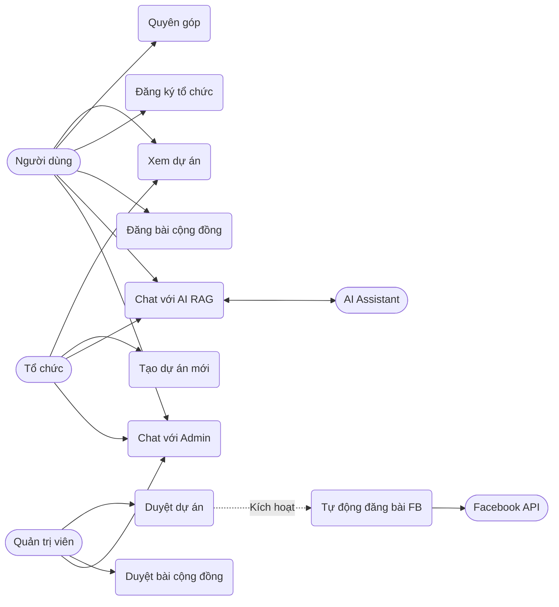
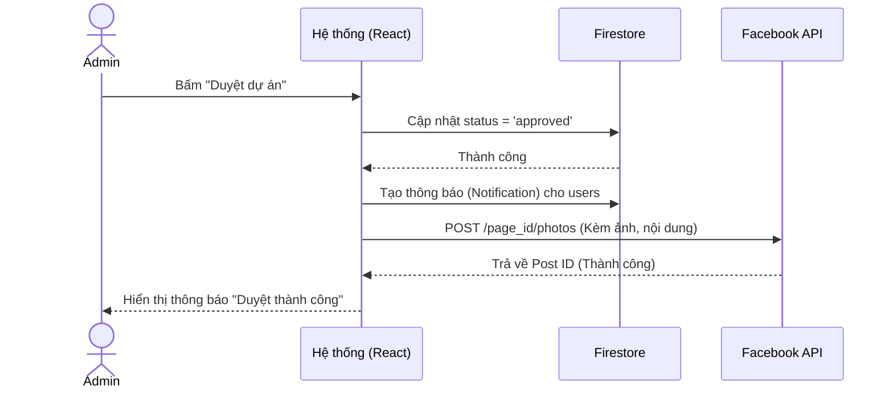
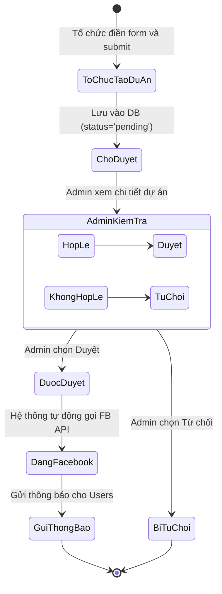

# Nuôi Em - Nền tảng Quyên góp Từ thiện Trực tuyến

**Nuôi Em** là một nền tảng web ứng dụng công nghệ để kết nối những nhà hảo tâm với các hoàn cảnh khó khăn, các dự án thiện nguyện trên khắp Việt Nam. Nền tảng cung cấp một hệ sinh thái minh bạch, dễ sử dụng, tích hợp trí tuệ nhân tạo (AI) để hỗ trợ người dùng và tự động hóa các quy trình truyền thông.

---

## 🚀 Công nghệ sử dụng (Tech Stack)

- **Frontend:** React 18, TypeScript, Vite, Tailwind CSS, Lucide React (Icons).
- **Backend & Database:** Firebase (Authentication, Firestore Database, Cloud Storage).
- **AI Integration:** Google Gemini API (Gemini 3 Flash Preview) tích hợp RAG (Retrieval-Augmented Generation).
- **External API:** Facebook Graph API (Tự động đăng bài).
- **Routing:** React Router DOM.
- **Date Formatting:** date-fns.

---

## 📑 Software Requirements Specification (SRS)

### 1. Giới thiệu (Introduction)
**Mục đích:** Xây dựng một cầu nối minh bạch giữa người cần giúp đỡ (thông qua các tổ chức) và người muốn giúp đỡ (nhà hảo tâm).
**Phạm vi:** Hệ thống cho phép người dùng quyên góp, các tổ chức đăng dự án, và quản trị viên kiểm duyệt nội dung, hỗ trợ trực tuyến.

### 2. Phân quyền người dùng (User Roles)
Hệ thống chia làm 3 vai trò chính:
1. **Người dùng (User - Role 1):** Người dùng thông thường, nhà hảo tâm.
2. **Tổ chức (Organization - Role 2):** Các tổ chức từ thiện đã được xác thực.
3. **Quản trị viên (Admin - Role 0):** Người quản lý toàn bộ hệ thống.

### 3. Yêu cầu chức năng (Functional Requirements)

#### 3.1. Module Xác thực & Tài khoản (Authentication)
- Đăng ký, Đăng nhập bằng Email/Mật khẩu (Firebase Auth).
- Quản lý hồ sơ cá nhân.
- Nâng cấp tài khoản thành Tổ chức (Cần nộp giấy tờ chứng thực và chờ Admin duyệt).

#### 3.2. Module Dự án Quyên góp (Campaigns)
- **Tổ chức:** Tạo dự án mới (Tên, mô tả, mục tiêu, ngày kết thúc, ảnh bìa).
- **Admin:** Kiểm duyệt dự án (Duyệt/Từ chối).
- **Tự động hóa (Auto-post):** Tự động chia sẻ dự án lên Facebook Page ngay khi Admin duyệt thành công.
- **Người dùng:** Xem danh sách dự án, tìm kiếm, lọc theo danh mục, và thực hiện quyên góp.

#### 3.3. Module Cộng đồng & Tin tức (Community & News)
- **Người dùng:** Đăng bài viết chia sẻ lên cộng đồng (Cần Admin duyệt).
- **Admin:** Đăng tải tin tức, hoạt động của nền tảng. Quản lý, kiểm duyệt và xóa bài viết cộng đồng.

#### 3.4. Module Tương tác & Hỗ trợ (Chat & Support)
- **AI Chatbot (RAG):** Trợ lý ảo tích hợp Gemini AI, tự động đọc dữ liệu thực tế từ Firestore (các dự án đang chạy, thông tin tổ chức) để tư vấn chính xác cho người dùng.
- **Live Chat:** Người dùng có thể chat trực tiếp với Admin.
- **Admin Chat Dashboard:** Admin quản lý danh sách các cuộc hội thoại, nhận thông báo tin nhắn chưa đọc và trả lời người dùng theo thời gian thực.
- *UI/UX:* Cửa sổ chat tự động đóng khi click ra ngoài vùng chat.

#### 3.5. Module Thông báo (Notifications)
- Hệ thống thông báo realtime (chuông thông báo) cho người dùng khi:
  - Dự án mới được duyệt.
  - Bài viết cộng đồng được duyệt.
  - Yêu cầu tạo tổ chức được duyệt/từ chối.

#### 3.6. Module Quản trị (Admin Dashboard)
- Thống kê tổng quan: Số lượng dự án, tin tức, tổng số tiền quyên góp.
- Quản lý & Kiểm duyệt: Dự án, Tin tức, Bài viết cộng đồng, Yêu cầu tổ chức.
- Quản lý danh sách tổ chức từ thiện.

### 4. Yêu cầu phi chức năng (Non-Functional Requirements)
- **Giao diện (UI/UX):** Thiết kế Responsive, hoạt động tốt trên cả Mobile và Desktop. Sử dụng Tailwind CSS với phong cách hiện đại, thân thiện.
- **Hiệu suất:** Tải trang nhanh, cập nhật dữ liệu realtime mượt mà thông qua Firestore `onSnapshot`.
- **Bảo mật:** Dữ liệu được bảo vệ qua Firebase Security Rules. Các API Keys (Gemini, Facebook) được bảo mật qua Environment Variables.

---

## 📊 Sơ đồ thiết kế (UML Diagrams)

### 1. Sơ đồ Use Case (Use Case Diagram)
Mô tả các chức năng chính của hệ thống và các tác nhân (Actors) tương tác với hệ thống.



### 2. Sơ đồ Tuần tự (Sequence Diagram) - Duyệt dự án & Auto-post Facebook
Mô tả luồng xử lý khi Admin duyệt một dự án và hệ thống tự động đăng bài lên Facebook.



### 3. Sơ đồ Hoạt động (Activity Diagram) - Quá trình tạo và duyệt dự án
Mô tả các bước từ khi Tổ chức tạo dự án đến khi dự án được hiển thị và chia sẻ.



---

## 📝 Đặc tả Use Case (Use Case Specifications)

### Use Case: Duyệt dự án và Tự động đăng Facebook
- **Tác nhân (Actor):** Quản trị viên (Admin), Facebook API.
- **Mô tả:** Admin kiểm tra thông tin dự án do Tổ chức gửi lên. Nếu hợp lệ, Admin duyệt dự án. Hệ thống tự động cập nhật trạng thái, gửi thông báo cho người dùng và tự động tạo một bài viết (kèm ảnh bìa và thông tin dự án) lên Facebook Page.
- **Tiền điều kiện:** Admin đã đăng nhập. Có ít nhất 1 dự án đang ở trạng thái chờ duyệt (pending). Đã cấu hình Facebook Access Token.
- **Luồng sự kiện chính:**
  1. Admin truy cập tab "Duyệt dự án" trong Admin Dashboard.
  2. Hệ thống hiển thị danh sách dự án chờ duyệt.
  3. Admin xem chi tiết dự án và bấm "Duyệt dự án".
  4. Hệ thống cập nhật trạng thái dự án thành `approved` trong Firestore.
  5. Hệ thống tạo các bản ghi thông báo (Notification) cho tất cả người dùng.
  6. Hệ thống gọi Facebook Graph API (`/photos`) truyền vào URL ảnh, nội dung caption (Tên dự án, Danh mục, Mục tiêu, Ngày kết thúc, Mô tả) và Access Token.
  7. Facebook API trả về kết quả thành công.
  8. Hệ thống hiển thị thông báo "Duyệt thành công" cho Admin.
- **Luồng ngoại lệ:** Nếu gọi Facebook API thất bại (sai token, lỗi mạng), hệ thống ghi log lỗi nhưng dự án vẫn được duyệt thành công trên web.

### Use Case: Chat với AI (Tích hợp RAG)
- **Tác nhân (Actor):** Người dùng (User/Organization), Gemini AI.
- **Mô tả:** Người dùng đặt câu hỏi cho AI Chatbot. Hệ thống tự động lấy thông tin các dự án đang hoạt động và danh sách tổ chức từ database làm ngữ cảnh (Context) gửi cho AI để AI trả lời chính xác dựa trên dữ liệu thực tế của nền tảng.
- **Tiền điều kiện:** Không yêu cầu đăng nhập.
- **Luồng sự kiện chính:**
  1. Người dùng mở Chat Widget và chọn tab "Chat với AI".
  2. Người dùng nhập câu hỏi (VD: "Có dự án nào về giáo dục đang chạy không?") và bấm gửi.
  3. Hệ thống truy vấn Firestore lấy danh sách dự án (`status == 'approved'`) và danh sách tổ chức.
  4. Hệ thống tổng hợp dữ liệu thành một đoạn văn bản (Context).
  5. Hệ thống gửi Prompt bao gồm: System Instruction + Context + Câu hỏi của người dùng tới Gemini API.
  6. Gemini API xử lý và trả về câu trả lời.
  7. Hệ thống hiển thị câu trả lời lên giao diện chat cho người dùng.

---

## ⚙️ Hướng dẫn cài đặt (Setup & Installation)

### Bước 1: Clone dự án và cài đặt thư viện
```bash
npm install
```

### Bước 2: Cấu hình biến môi trường
Tạo file `.env` ở thư mục gốc của dự án và điền các thông tin sau:

```env
# Firebase Configuration
VITE_FIREBASE_API_KEY=your_firebase_api_key
VITE_FIREBASE_AUTH_DOMAIN=your_firebase_auth_domain
VITE_FIREBASE_PROJECT_ID=your_firebase_project_id
VITE_FIREBASE_STORAGE_BUCKET=your_firebase_storage_bucket
VITE_FIREBASE_MESSAGING_SENDER_ID=your_sender_id
VITE_FIREBASE_APP_ID=your_app_id

# AI Chatbot Configuration
VITE_GEMINI_API_KEY=your_gemini_api_key

# Facebook Auto-post Configuration
VITE_FACEBOOK_PAGE_ID=your_facebook_page_id
VITE_FACEBOOK_PAGE_ACCESS_TOKEN=your_facebook_page_access_token
```

### Bước 3: Chạy ứng dụng (Development)
```bash
npm run dev
```
Ứng dụng sẽ chạy tại `http://localhost:3000`.

### Bước 4: Build ứng dụng (Production)
```bash
npm run build
```

---

## 📂 Cấu trúc thư mục chính (Folder Structure)

```text
src/
├── components/        # Các component UI tái sử dụng (ChatWidget, Navbar, Layout...)
├── context/           # React Context (AuthContext quản lý state đăng nhập)
├── lib/               # Các file cấu hình thư viện (firebase.ts, uploadImage.ts)
├── pages/             # Các trang chính (Home, AdminDashboard, Campaigns...)
├── types/             # Định nghĩa TypeScript Interfaces/Types
├── App.tsx            # Component gốc, cấu hình Routing
└── main.tsx           # Entry point của ứng dụng
```

---

## 🤝 Đóng góp (Contributing)
Dự án được phát triển với mục đích cộng đồng. Mọi đóng góp về code, báo cáo lỗi (issues) hay đề xuất tính năng đều được hoan nghênh!
