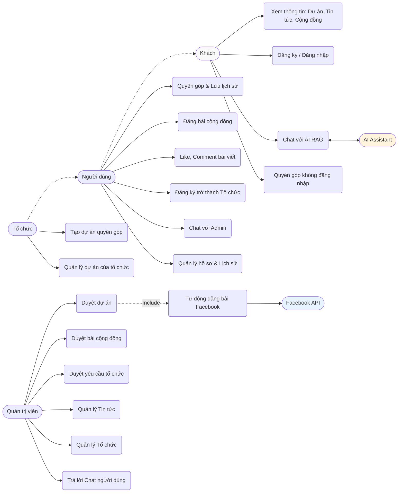
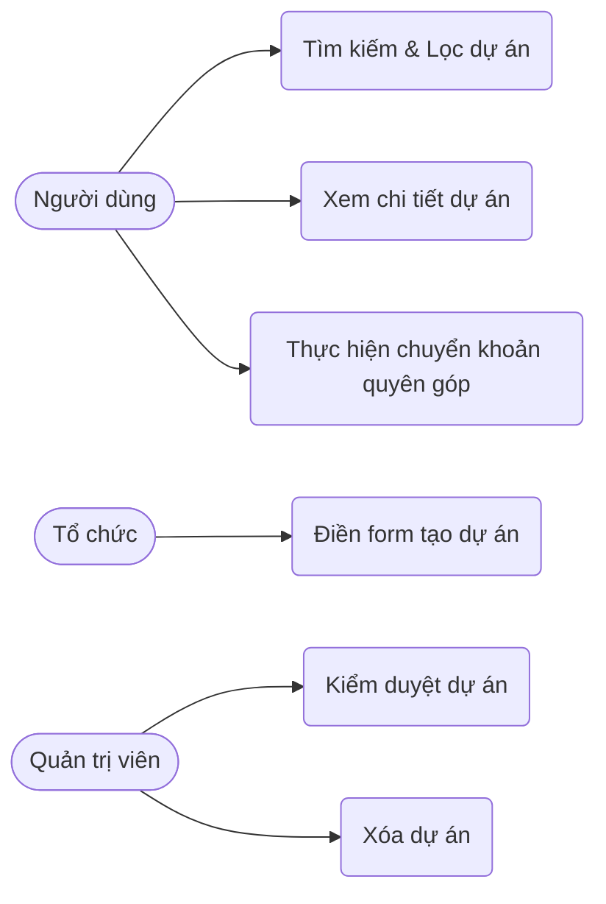
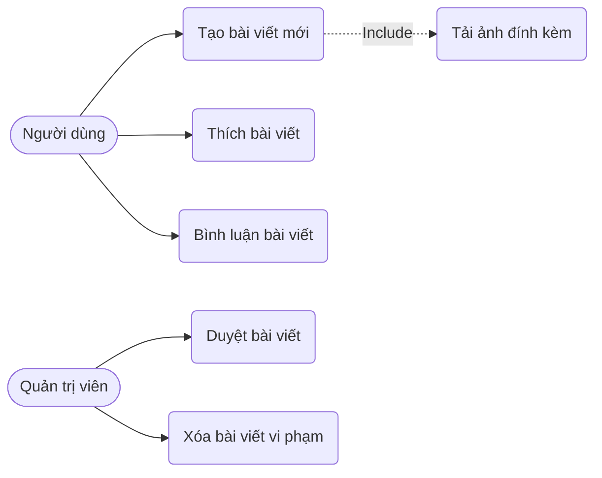
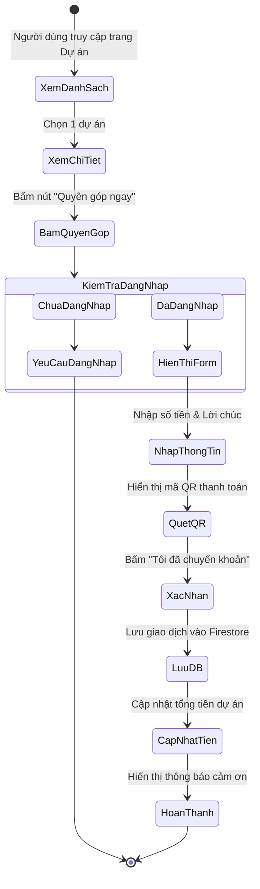
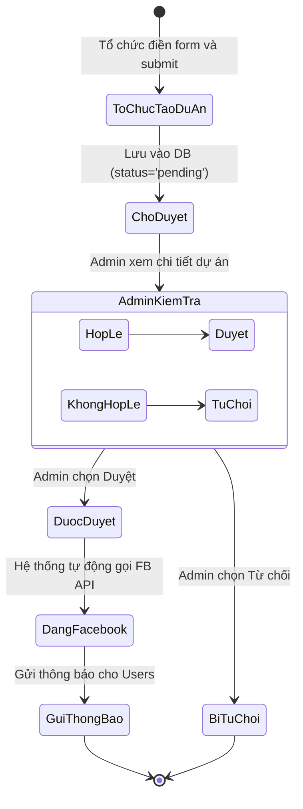
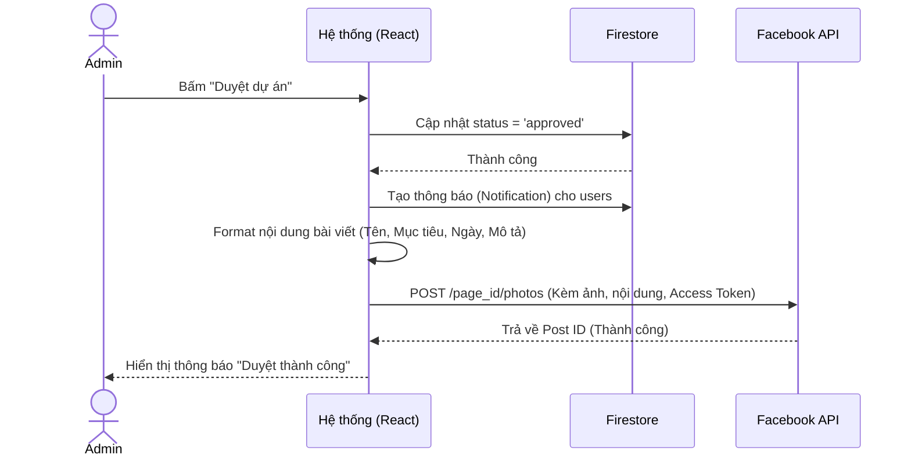

# Nuôi Em - Nền tảng Quyên góp Từ thiện Trực tuyến

**Nuôi Em** là một nền tảng web ứng dụng công nghệ để kết nối những nhà hảo tâm với các hoàn cảnh khó khăn, các dự án thiện nguyện trên khắp Việt Nam. Nền tảng cung cấp một hệ sinh thái minh bạch, dễ sử dụng, tích hợp trí tuệ nhân tạo (AI) để hỗ trợ người dùng và tự động hóa các quy trình truyền thông.

---

## 🚀 Công nghệ sử dụng (Tech Stack)

- **Frontend:** React 18, TypeScript, Vite, Tailwind CSS, Lucide React (Icons).
- **Backend & Database:** Firebase (Authentication, Firestore Database, Cloud Storage).
- **AI Integration:** Google Gemini API (Gemini 3 Flash Preview) tích hợp RAG (Retrieval-Augmented Generation).
- **External API:** Facebook Graph API (Tự động đăng bài).
- **Routing:** React Router DOM.
- **Date Formatting:** date-fns.

---

## 🌟 Các chức năng chính (Key Features)

Hệ thống phân chia người dùng thành 3 vai trò (Roles):
- **Role 1 (Người dùng/Nhà hảo tâm):** Đăng ký/Đăng nhập, xem dự án, quyên góp, đăng bài cộng đồng, nâng cấp thành tổ chức, chat với AI/Admin, nhận thông báo.
- **Role 2 (Tổ chức):** Bao gồm quyền của Role 1, có thêm quyền tạo dự án quyên góp, quản lý dự án của tổ chức.
- **Role 0 (Quản trị viên - Admin):** Quản lý toàn bộ hệ thống, duyệt dự án, duyệt bài viết, duyệt tổ chức, đăng tin tức, chat hỗ trợ người dùng.

### 1. Dành cho Khách (Guest)
- Xem trang chủ, danh sách dự án, chi tiết dự án, tin tức, bài viết cộng đồng.
- Chat với AI Assistant để được tư vấn (sử dụng RAG lấy dữ liệu thực tế từ hệ thống).
- Đăng ký, đăng nhập.

### 2. Dành cho Người dùng (User)
- **Quyên góp:** Thực hiện quyên góp cho các dự án, để lại lời chúc.
- **Cộng đồng:** Đăng bài viết chia sẻ (chờ duyệt), Like, Comment bài viết của người khác.
- **Hồ sơ:** Xem lịch sử quyên góp, cập nhật thông tin cá nhân.
- **Đăng ký Tổ chức:** Gửi yêu cầu nâng cấp tài khoản thành Tổ chức (cung cấp tên, mô tả, logo, giấy tờ chứng thực).
- **Hỗ trợ:** Chat trực tiếp với Admin.
- **Thông báo:** Nhận thông báo realtime khi dự án/bài viết/yêu cầu tổ chức được duyệt.

### 3. Dành cho Tổ chức (Organization)
- **Quản lý dự án:** Tạo dự án quyên góp mới (cần Admin duyệt).
- Theo dõi tiến độ quyên góp của các dự án do tổ chức quản lý.

### 4. Dành cho Quản trị viên (Admin)
- **Dashboard:** Xem thống kê tổng quan (số dự án, tin tức, tổng tiền quyên góp).
- **Kiểm duyệt:**
  - Duyệt/Từ chối dự án mới. **Tự động đăng bài lên Facebook Page** khi dự án được duyệt.
  - Duyệt/Từ chối bài viết cộng đồng.
  - Duyệt/Từ chối yêu cầu đăng ký Tổ chức.
- **Quản lý nội dung:** Đăng tin tức mới, xóa dự án/tin tức/bài viết vi phạm.
- **Quản lý tổ chức:** Xem danh sách tổ chức, xóa tổ chức (hạ quyền về User).
- **Hỗ trợ trực tuyến:** Quản lý danh sách chat, trả lời tin nhắn của người dùng.

---

## 🛡️ Yêu cầu phi chức năng (Non-Functional Requirements)

1. **Giao diện (UI/UX):** Thiết kế Responsive, hoạt động mượt mà trên cả Mobile, Tablet và Desktop. Sử dụng Tailwind CSS với phong cách hiện đại, thân thiện, màu sắc ấm áp (Pink/Rose).
2. **Hiệu suất:** Tải trang nhanh, cập nhật dữ liệu realtime mượt mà thông qua Firestore `onSnapshot` (Chat, Thông báo).
3. **Bảo mật:** 
   - Dữ liệu được bảo vệ qua Firebase Security Rules.
   - Mật khẩu được mã hóa bởi Firebase Auth.
   - Các API Keys (Gemini, Facebook) được bảo mật qua Environment Variables, không lộ trên client-side đối với các tác vụ nhạy cảm.
4. **Tính khả dụng:** Hệ thống hoạt động 24/7, AI Chatbot luôn sẵn sàng hỗ trợ người dùng giải đáp thắc mắc.

---

## 📊 Phân tích thiết kế hệ thống (System Design & Analysis)

### 1. Sơ đồ Use Case tổng quan (General Use Case Diagram)



### 2. Sơ đồ Use Case phân rã (Decomposed Use Case Diagrams)

#### 2.1. Phân rã Quản lý Dự án & Quyên góp


#### 2.2. Phân rã Quản lý Cộng đồng


### 3. Quy trình nghiệp vụ (Business Processes)

#### 3.1. Activity Diagram: Quy trình Quyên góp


#### 3.2. Activity Diagram: Quy trình Tạo và Duyệt dự án


#### 3.3. Sequence Diagram: Tự động đăng Facebook khi duyệt dự án


### 4. Đặc tả Use Case (Use Case Specifications)

#### UC01: Quyên góp cho dự án
- **Tác nhân:** Người dùng (User).
- **Mô tả:** Người dùng chọn một dự án, nhập số tiền muốn quyên góp, quét mã QR để chuyển khoản và để lại lời chúc.
- **Tiền điều kiện:** Người dùng đã đăng nhập. Dự án đang ở trạng thái hoạt động.
- **Luồng sự kiện chính:**
  1. Người dùng bấm "Quyên góp ngay" tại trang chi tiết dự án.
  2. Hệ thống hiển thị modal nhập số tiền và lời chúc.
  3. Người dùng nhập thông tin và bấm "Tiếp tục".
  4. Hệ thống tạo mã QR thanh toán dựa trên số tiền.
  5. Người dùng quét mã QR bằng ứng dụng ngân hàng và bấm "Tôi đã chuyển khoản".
  6. Hệ thống lưu thông tin giao dịch vào Firestore, cập nhật số tiền đã quyên góp của dự án.
  7. Hệ thống hiển thị thông báo cảm ơn và cập nhật danh sách người ủng hộ.

#### UC02: Đăng ký trở thành Tổ chức
- **Tác nhân:** Người dùng (User), Quản trị viên (Admin).
- **Mô tả:** Người dùng gửi yêu cầu nâng cấp tài khoản thành Tổ chức để có thể tạo dự án. Admin sẽ kiểm duyệt yêu cầu này.
- **Tiền điều kiện:** Người dùng đã đăng nhập và đang là Role 1.
- **Luồng sự kiện chính:**
  1. Người dùng vào trang Hồ sơ, chọn tab "Đăng ký tổ chức".
  2. Người dùng điền Tên tổ chức, Mô tả, tải lên Logo và Giấy tờ chứng thực (PDF/Ảnh).
  3. Hệ thống lưu yêu cầu vào collection `organization_requests` với trạng thái `pending`.
  4. Admin vào Dashboard, tab "Duyệt tổ chức".
  5. Admin xem thông tin, giấy tờ và bấm "Duyệt".
  6. Hệ thống cập nhật Role của người dùng thành 2, tạo bản ghi trong collection `organizations`.
  7. Hệ thống gửi thông báo cho người dùng.

#### UC03: Duyệt dự án và Tự động đăng Facebook
- **Tác nhân:** Quản trị viên (Admin), Facebook API.
- **Mô tả:** Admin kiểm tra thông tin dự án do Tổ chức gửi lên. Nếu hợp lệ, Admin duyệt dự án. Hệ thống tự động cập nhật trạng thái, gửi thông báo cho người dùng và tự động tạo một bài viết lên Facebook Page.
- **Tiền điều kiện:** Admin đã đăng nhập. Có ít nhất 1 dự án đang chờ duyệt. Đã cấu hình Facebook Access Token.
- **Luồng sự kiện chính:**
  1. Admin truy cập tab "Duyệt dự án" trong Admin Dashboard.
  2. Admin xem chi tiết dự án và bấm "Duyệt dự án".
  3. Hệ thống cập nhật trạng thái dự án thành `approved` trong Firestore.
  4. Hệ thống tạo các bản ghi thông báo (Notification) cho tất cả người dùng.
  5. Hệ thống gọi Facebook Graph API (`/photos`) truyền vào URL ảnh, nội dung caption và Access Token.
  6. Facebook API trả về kết quả thành công.
  7. Hệ thống hiển thị thông báo "Duyệt thành công" cho Admin.

#### UC04: Chat với AI (Tích hợp RAG)
- **Tác nhân:** Khách/Người dùng, Gemini AI.
- **Mô tả:** Người dùng đặt câu hỏi cho AI Chatbot. Hệ thống tự động lấy thông tin các dự án đang hoạt động và danh sách tổ chức từ database làm ngữ cảnh (Context) gửi cho AI để AI trả lời chính xác dựa trên dữ liệu thực tế.
- **Tiền điều kiện:** Không yêu cầu đăng nhập.
- **Luồng sự kiện chính:**
  1. Người dùng mở Chat Widget và chọn tab "Chat với AI".
  2. Người dùng nhập câu hỏi (VD: "Có dự án nào về giáo dục đang chạy không?") và bấm gửi.
  3. Hệ thống truy vấn Firestore lấy danh sách dự án (`status == 'approved'`) và danh sách tổ chức.
  4. Hệ thống tổng hợp dữ liệu thành một đoạn văn bản (Context).
  5. Hệ thống gửi Prompt bao gồm: System Instruction + Context + Câu hỏi của người dùng tới Gemini API.
  6. Gemini API xử lý và trả về câu trả lời.
  7. Hệ thống hiển thị câu trả lời lên giao diện chat.

---

## ⚙️ Hướng dẫn cài đặt (Setup & Installation)

### Bước 1: Clone dự án và cài đặt thư viện
```bash
npm install
```

### Bước 2: Cấu hình biến môi trường
Tạo file `.env` ở thư mục gốc của dự án và điền các thông tin sau:

```env
# Firebase Configuration
VITE_FIREBASE_API_KEY=your_firebase_api_key
VITE_FIREBASE_AUTH_DOMAIN=your_firebase_auth_domain
VITE_FIREBASE_PROJECT_ID=your_firebase_project_id
VITE_FIREBASE_STORAGE_BUCKET=your_firebase_storage_bucket
VITE_FIREBASE_MESSAGING_SENDER_ID=your_sender_id
VITE_FIREBASE_APP_ID=your_app_id

# AI Chatbot Configuration
VITE_GEMINI_API_KEY=your_gemini_api_key

# Facebook Auto-post Configuration
VITE_FACEBOOK_PAGE_ID=your_facebook_page_id
VITE_FACEBOOK_PAGE_ACCESS_TOKEN=your_facebook_page_access_token
```

### Bước 3: Chạy ứng dụng (Development)
```bash
npm run dev
```
Ứng dụng sẽ chạy tại `http://localhost:3000`.

### Bước 4: Build ứng dụng (Production)
```bash
npm run build
```

---

## 📂 Cấu trúc thư mục chính (Folder Structure)

```text
src/
├── components/        # Các component UI tái sử dụng (ChatWidget, Navbar, Layout...)
├── context/           # React Context (AuthContext quản lý state đăng nhập)
├── lib/               # Các file cấu hình thư viện (firebase.ts, uploadImage.ts)
├── pages/             # Các trang chính (Home, AdminDashboard, Campaigns, Community...)
├── types/             # Định nghĩa TypeScript Interfaces/Types
├── App.tsx            # Component gốc, cấu hình Routing
└── main.tsx           # Entry point của ứng dụng
```

---

## 🤝 Đóng góp (Contributing)
Dự án được phát triển với mục đích cộng đồng. Mọi đóng góp về code, báo cáo lỗi (issues) hay đề xuất tính năng đều được hoan nghênh!
